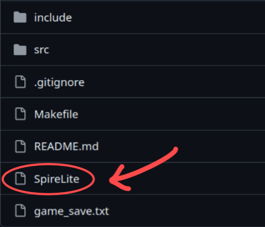

# Spire Lite
**A tiny text-based deckbuilding climb.**

## Team Members
Please fill in your official team information before submission.

- Team member 1: Zhang Haobin
- Team member 2: Peng Yik Sz
- Team member 3: Yeung Long
- Team member 4: Zhang Hanyun

## Application Description
Spire Lite is a playable terminal-based card battle game inspired by Slay the Spire. The player starts a new run, chooses a difficulty level, climbs through a randomly generated map, enters enemy encounters and events, improves their deck through rewards, and tries to defeat the final boss.

The game is designed as a simple but complete deckbuilding loop. Each battle uses a hand, draw pile, discard pile, energy system, player block, enemy armor, and card effects. Between battles, the player can gain cards, recover HP, resolve random events, and continue climbing until the run ends in victory or defeat.

Spire Lite also keeps save data and records, so the player can continue an unfinished run and view the best score, highest stage, wins, and losses.

## Features
- Text-based menu system with welcome, lobby, map, battle, record, help, and end screens.
- Three difficulty levels: Easy, Normal, and Hard.
- Randomly generated map with normal enemy rooms, event rooms, and a final boss room.
- Turn-based card combat with energy, block, enemy armor, draw pile, discard pile, and hand size limits.
- Starter deck and reward cards generated through a card factory.
- Multiple card effects, including attack, block, healing, energy recovery, block doubling, self-damage for energy, and scaling damage.
- Multiple enemy types that change as the player reaches higher stages.
- Random events such as healing, traps, card removal, card gain, and mystery outcomes.
- File input/output for current run saves and long-term game records.
- Modular source code split across multiple header and source files.
- Dynamic data structures such as vectors, maps, and saved map layers.
- Dynamic memory management in card reward generation, where temporary reward choices are created with a dynamic array and released after use.

## Non-standard Libraries
This project does not use any non-standard libraries.

## How to run the game?
1. On File Explorer / Finder, open the Spire Lite folder.
    * On File Explorer / Finder, you should see the "SpireLite" file, like this:

    

2. Open **Terminal** on the Spire Lite folder:
    * On **Windows**, follow [these steps](https://johnwargo.com/posts/2024/launch-windows-terminal/).
    * On **Mac**, follow [these steps](https://www.youtube.com/watch?v=6rzT130xpM4).
    * On **Linux**, open Terminal and run ```cd``` on the Spire Lite folder.

3. Run the game!
    * On **Windows**, enter this command: ```SpireLite```
    * On **Linux / Mac**, enter this command: ```./SpireLite```

4. Spire Lite should now appear. Enjoy!

## Compilation (using make)
1. Open Terminal.

2. Make sure you are on the right folder before you proceed.

3. Run ```make clean && make main```

## Save Files
The game uses local text files for save data:

- `game_save.txt` stores the current unfinished run.
- `save.txt` stores long-term game records such as best score, highest stage, wins, and losses.
