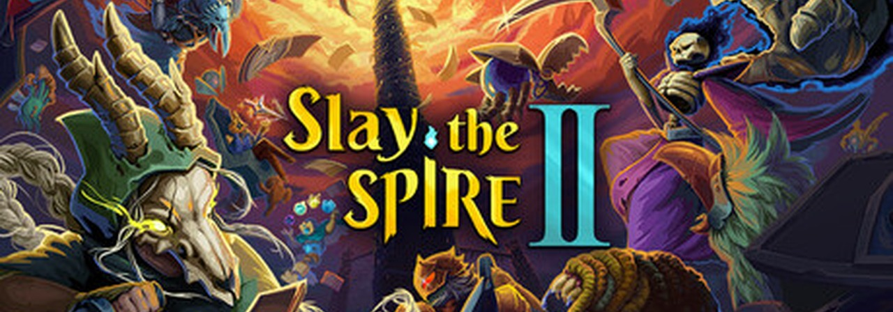

# Spire Lite

**A tiny text-based deckbuilding climb inspired by Slay the Spire.**

# Menu
1. [For Player](#for-player)
    1. [Team Members](#team-members)
    2. [How to Download and Run](#how-to-download-and-run)
    3. [Demo Video](#demo-video)
    4. [Warning](#warning)
    5. [How to Play](#how-to-play)
    6. [Features Implemented](#features-implemented)
    7. [Description](#description)
    8. [Difficulty Levels](#difficulty-levels)
    9. [Non-standard Libraries](#non-standard-libraries)
2. [For Developer](#for-developer)
    1. [Code Structure](#code-structure)
    2. [Main Classes and Files](#main-classes-and-files)
    3. [Dynamic Memory Management](#dynamic-memory-management)
    4. [File Input and Output](#file-input-and-output)

<a id="for-player"></a>
# For Player

<a id="team-members"></a>
## Team Members 👥
- [Zhang Haobin](https://github.com/Zhang-Haobin)
- [Peng Yik Sz](https://github.com/ZFSR)
- [Yeung Long](https://github.com/dyn-p)
- [Zhang Hanyun](https://github.com/TinaZhang0424)

<a id="how-to-download-and-run"></a>
## How to Download and Run 🚀
The executable file `SpireLite` is not uploaded to GitHub. Please download the source code and compile it first.

1. On GitHub, click **Code** and then **Download ZIP**.

2. Unzip the downloaded file.

3. Open the unzipped folder named `Comp2113-Project-main`.

4. Open **Terminal** in the `Comp2113-Project-main` folder.
    - On **Windows**, you can use Windows Terminal, Git Bash, or WSL.
    - On **Mac / Linux**, open Terminal and `cd` into the `Comp2113-Project-main` folder.

5. Compile the game:
    ```bash
    make clean && make main
    ```

6. Run the game:
    ```bash
    ./SpireLite
    ```

7. Spire Lite should now appear in the terminal. Enjoy!

<a id="demo-video"></a>
## Demo Video 🎬
[](https://youtu.be/74wJlqoDsLc)

Watch the demo on YouTube: [https://youtu.be/74wJlqoDsLc](https://youtu.be/74wJlqoDsLc)

<a id="warning"></a>
## Warning ⚠️
ANSI escape sequences may not work in some older terminals, especially old Windows cmd. If colors or clear-screen behavior looks strange, use a modern terminal such as Windows Terminal, macOS Terminal, or a Linux terminal.

<a id="how-to-play"></a>
## How to Play 🎮
- Enter the number shown beside a menu option to choose it.
- Start a new run, choose a difficulty level, and climb through the generated map.
- In battle, each card costs energy. Unused energy does not carry over to the next turn.
- Attack cards automatically target the enemy when only one enemy is alive.
- When multiple enemies are alive, single-target attack cards ask which enemy to attack.
- AOE cards such as `Cleave` hit all alive enemies.
- Potions appear as battle options and are consumed after use.
- After battles, choose reward cards, recover HP, and continue climbing.
- The run ends when the player defeats the final boss or dies.

<a id="features-implemented"></a>
## Features Implemented ✨
- **Generation of random game sets or events 🎲**

    The map contains random normal enemy rooms, event rooms, and a final boss room. Enemy encounters, card rewards, potion drops, double-enemy encounters, and event outcomes are also randomly generated.

- **Data structures for storing game status 🧱**

    The game uses `vector` for decks, hands, draw piles, discard piles, enemies, potions, reward cards, map layers, and map nodes. It also uses `unordered_map` in battle to map player input options to actions.

- **Dynamic memory management 🧠**

    Temporary card arrays are created with `new[]` and released with `delete[]` in card reward generation and the card library screen.

- **File input/output 💾**

    The game saves unfinished runs to `saves/game_save.txt` and long-term records to `saves/save.txt`.

- **Program codes in multiple files 📁**

    The project is split into separate header and source files for cards, battles, enemies, players, potions, map generation, events, save/load, difficulty settings, and the main game loop.

- **Multiple difficulty levels ⛰️**

    Easy, Normal, and Hard change player HP, map length, enemy HP, enemy damage, score gain, and double-enemy encounter frequency.

<a id="description"></a>
## Description 📖
Spire Lite is a terminal-based card battle game. The player starts a run with a small deck, chooses a difficulty level, and climbs through a randomly generated map. Each room may contain a battle, a random event, or the final boss.

Battles use a deckbuilding loop with a hand, draw pile, discard pile, energy system, block, enemy armor, card effects, and potions. Between battles, the player can gain new cards, recover HP, resolve events, and continue moving through the map.

The game also includes save data and records, so the player can continue an unfinished run and view the best score, highest stage, wins, losses, and win rate.

<a id="difficulty-levels"></a>
## Difficulty Levels ⚔️
Difficulty changes player HP, map length, enemy HP, enemy damage, and score gain.

| Difficulty | Player HP | Floors | Enemy HP | Enemy Damage | Score |
| --- | ---: | ---: | ---: | ---: | ---: |
| Easy | 70 | 8 | x0.8 | x0.8 | x0.8 |
| Normal | 60 | 12 | x1.0 | x1.0 | x1.0 |
| Hard | 50 | 16 | x1.4 | x1.3 | x1.5 |

Normal and Hard can also generate double-enemy encounters later in the run. Easy keeps battles simpler.

<a id="non-standard-libraries"></a>
## Non-standard Libraries 📚
Not used. This project only uses standard C++ libraries.

<a id="for-developer"></a>
# For Developer

<a id="code-structure"></a>
## Code Structure 🧩
- `src/main.cpp` controls the main game loop, screen flow, map transitions, and global run state.
- `src/battle.cpp` handles combat, card use, enemy attacks, potion use, rewards, and victory/defeat logic.
- `src/Card.cpp` defines card templates and card data.
- `src/Cardfactory.cpp` creates starter decks, random cards, reward cards, and card name lists.
- `src/Potion.cpp` defines potion templates and random potion generation.
- `src/map.cpp` generates and displays the room map.
- `src/event_screen.cpp` handles random event rooms.
- `src/game_state.cpp` saves and loads the current unfinished run.
- `src/save.cpp` stores long-term records such as best score, wins, losses, and win rate.
- `src/difficulty.cpp` defines and applies Easy, Normal, and Hard difficulty settings.

<a id="main-classes-and-files"></a>
## Main Classes and Files 🛠️
### class `Player`
Defined in `include/player.h`.

Stores player HP, energy, block, difficulty, stage, deck, potions, hand, draw pile, and discard pile.

### class `Battle`
Defined in `include/battle.h`.

Owns one combat state, including the current player state, enemies, valid menu options, selected card, selected target, and battle round.

### class `Card`
Defined in `include/Card.h`.

Stores card name, type, cost, description, effect, and target information.

### struct `Cardfactory`
Defined in `include/Cardfactory.h`.

Creates card objects from names, builds the starter deck, generates random reward cards, and provides card name pools.

### class `Map`
Defined in `include/map.h`.

Stores map layers, map nodes, current position, and reachable next rooms.

### class `Enemy`
Defined in `include/enemy.h`.

Stores enemy HP, armor, damage, and attack behavior.

### class `Potion`
Defined in `include/Potion.h`.

Stores potion name, description, type, value, and target requirement.

<a id="dynamic-memory-management"></a>
## Dynamic Memory Management 🧠
Dynamic memory is used in two places:

```cpp
Card* reward_choices = new Card[count];
delete[] reward_choices;
```

This is used in `Cardfactory::create_reward_card()` to create temporary reward choices.

```cpp
Card* cards = new Card[card_count];
delete[] cards;
```

This is used in `card_library_screen()` to create a temporary card template array for printing the card library.

<a id="file-input-and-output"></a>
## File Input and Output 💾
- `saves/game_save.txt` stores the current unfinished run, including player data, deck, potions, score, difficulty, and map state.
- `saves/save.txt` stores long-term game records such as best score, highest stage, wins, losses, and win rate.

The game saves at key checkpoints, such as after creating a new run, after winning a normal battle, and after resolving an event.
